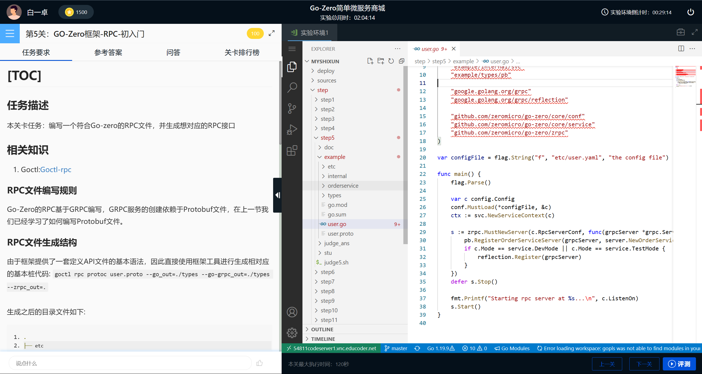

# 头歌实训项目-Go-Zero简单微服务商城
- [前端仓库](https://github.com/baiyz0825/school-share-buy-frontend) —— 实现部分功能
- 接口文档：仓库根目录下`deploy/api_doc/头歌Go-zero简单微服务接口.json` 导入ApiPost7中使用。
## 项目预览(Project View)
### 实训首页

### 任务列表


### 实训界面
任务选择题实训界面：


代码编辑界面：

## 技术栈
**Go-Zero、GoLang、Async、Mysql、Redis、OSS、Protobuf**

## 参考文档
> 部分代码风格编写方式 和 使用的代码框架 来自：
> 1. [go-zero-looklook](https://github.com/Mikaelemmmm/go-zero-looklook)
> 2. [go-zero-looklook视频](https://space.bilibili.com/389552232/video)
> 3. [go-zero框架](https://go-zero.dev/cn/)
> 4. [Gorm-gen](https://gorm.io/gen/index.html)
> 5. [Golang struct copier](https://github.com/jinzhu/copier)
> 6. [Docker-learn](https://yeasy.gitbook.io/docker_practice/introduction)
> 7. [Docker Docs](https://docs.docker.com/)
> 8. [Nginx-learn](https://xuexb.github.io/learn-nginx/)
> 9. [Nginx official Docs](https://www.nginx.com/learn/)
> 10. [Golang Docs](https://go.dev/doc/)
> 11. [Base64Captcha Golang](https://github.com/mojocn/base64Captcha)
> 12. [Golang Validator](https://github.com/go-playground/validator)


## 项目功能
### 基本功能
- 用户信息维护
- 用户注册、登陆
- 资源管理
- 资源上传 && 下载
- 资源购买

### 工程结构
```txt
.
├── LICENSE
├── README.md // 项目介绍
├── assert // 介绍图片文件
│   ├── project_img1.png
│   ├── project_img2.png
│   ├── project_img3.png
│   └── 任务实训.png
├── deploy // 部署配置
│   ├── db // 数据库Sql
│   │   ├── school-order.sql
│   │   ├── school-resources.sql
│   │   ├── school-trade.sql
│   │   └── shcool-user.sql
│   └── goctl-tpl // go-zero 模板
│       └── 1.5.0
│           ├── api
│           ├── docker
│           ├── kube
│           ├── model
│           ├── mongo
│           ├── newapi
│           └── rpc
├── sources // 项目源代码
│   ├── apps // 业务应用
│   │   ├── mq // 消息队列
│   │   │   └── cmd // 运行Main
│   │   ├── order // 订单服务
│   │   │   ├── cmd // 运行Main
│   │   │   └── gen // Gorm-gen生成代码
│   │   ├── resources // 资源服务
│   │   │   ├── cmd // 运行Main
│   │   │   └── gen // Gorm-gen生成代码
│   │   ├── trade // 交易服务
│   │   │   ├── cmd // 运行Main
│   │   │   └── gen // Gorm-gen生成代码
│   │   └── user // 用户服务
│   │       ├── cmd //  运行Main
│   │       └── gen // Gorm-gen生成代码
│   ├── common // 公共工具组件
│   │   ├── respresult // 封装请求响应数据对象
│   │   │   └── r.go
│   │   ├── utils // 工具类
│   │   │   ├── file_utils.go
│   │   │   ├── id_utils.go
│   │   │   ├── oss_utils.go
│   │   │   ├── string_utils.go
│   │   │   ├── struct_utils.go
│   │   │   ├── time_utils.go
│   │   │   └── validator_utils.go
│   │   ├── xconst // 常量
│   │   │   └── const.go
│   │   └── xerr // 自定义错误
│   │       ├── businessErr.go
│   │       └── xerr_code.go
│   ├── go.mod
│   └── go.sum
└── step // 头歌educoder任务测评脚本和任务介绍
    ├── step1
    │   └── doc // 文档
    │       └── 前言.md
    ├── step10
    │   ├── doc // 文档
    │   │   └── Gorm-Gen-快速入门.md
    │   ├── example // 示例代码
    │   │   ├── gen_by_db
    │   │   ├── gen_golang_type
    │   │   └── mission
    │   ├── judge10.sh // 测评脚本
    │   └── stu // 学生补全部分
    │       ├── gen
    │       ├── go.mod
    │       ├── go.sum
    │       ├── main.go
    │       ├── model
    │       ├── query
    │       └── user.sql
    ├── step11
    │   ├── differ.sh
    │   ├── doc
    │   │   └── User-RPC-服务-基本数据查询.md
    │   ├── judge11.sh
    │   ├── judge_ans
    │   │   └── ans.log
    │   └── judge_data
    │       └── school_user.sql
    ├── step12
    │   ├── doc
    │   │   └── Resources-RPC-服务-基本数据查询.md
    │   ├── judge12.sh // 测评脚本
    │   ├── judge_ans // 测评答案
    │   │   └── ans.log
    │   └── judge_data // 测评数据
    │       └── school_resources.sql
    ├── step13
    │   ├── doc
    │   │   └── Trade-RPC-服务-基本数据查询.md
    │   ├── judge13.sh
    │   ├── judge_ans
    │   │   └── ans.log
    │   └── judge_data
    │       └── school_trade.sql
    ├── step14
    │   ├── doc
    │   │   ├── Order-RPC-服务-基本数据查询.md
    │   │   ├── alipay-cert.png
    │   │   ├── alipay-doc1.png
    │   │   ├── alipay-doc2.png
    │   │   ├── alipay-order.drawio.png
    │   │   ├── andbox-dev1.png
    │   │   ├── dev-alip.png
    │   │   ├── dev-console.png
    │   │   ├── message-channel.png
    │   │   └── sandbox-condole.png
    │   ├── judge14.sh
    │   ├── judge_ans
    │   │   └── ans.log
    │   └── judge_data
    │       └── school_order.sql
    ├── step15
    │   ├── doc
    │   │   ├── User-API服务-基本功能.md
    │   │   └── user-api-oss.drawio.png
    │   ├── judge15.sh
    │   ├── judge_ans
    │   │   └── ans.log
    │   └── judge_data
    │       └── school_user.sql
    ├── step16
    │   ├── doc
    │   │   └── Resources-API-基本功能.md
    │   ├── judge16.sh
    │   ├── judge_ans
    │   │   └── ans.log
    │   └── judge_data
    │       ├── school_order.sql
    │       ├── school_resources.sql
    │       ├── school_trade.sql
    │       ├── school_user.sql
    │       ├── test_file_data.docx
    │       └── test_file_poster.png
    ├── step17
    │   ├── doc
    │   │   └── Trade-API-服务-基本功能.md
    │   ├── judge17.sh
    │   ├── judge_ans
    │   │   └── ans.log
    │   └── judge_data
    │       ├── school_resources.sql
    │       ├── school_trade.sql
    │       └── school_user.sql
    ├── step18
    │   ├── doc
    │   │   ├── Order-API-服务-基本功能.md
    │   │   └── alpay.png
    │   ├── judge18.sh
    │   ├── judge_ans
    │   │   └── ans.log
    │   └── judge_data
    │       ├── school_order.sql
    │       ├── school_resources.sql
    │       ├── school_trade.sql
    │       └── school_user.sql
    ├── step19
    │   └── doc
    │       ├── Mq-Scheduler-JOB-服务-基本功能.md
    │       ├── asynq.png
    │       ├── panel.png
    │       └── panel2.png
    ├── step2
    │   └── doc
    │       └── 项目概述.md
    ├── step3
    │   ├── doc
    │   │   └── Go-Zero框架-API-初入门.md
    │   ├── example
    │   │   ├── etc
    │   │   ├── go.mod
    │   │   ├── go.sum
    │   │   ├── internal
    │   │   ├── user.api
    │   │   └── user.go
    │   ├── judge3.sh
    │   └── stu
    │       ├── etc
    │       ├── go.mod
    │       ├── go.sum
    │       ├── internal
    │       ├── user.api
    │       └── user.go
    ├── step4
    │   ├── doc
    │   │   └── Protobuf初入门.md
    │   ├── example
    │   │   └── user.proto
    │   ├── judge4.sh
    │   └── stu
    │       └── user.proto
    ├── step5
    │   ├── doc
    │   │   └── Go-Zero框架-RPC-初入门.md
    │   ├── example
    │   │   ├── etc
    │   │   ├── go.mod
    │   │   ├── go.sum
    │   │   ├── internal
    │   │   ├── orderservice
    │   │   ├── types
    │   │   ├── user.go
    │   │   └── user.proto
    │   ├── judge5.sh
    │   ├── judge_ans
    │   │   └── ans.log
    │   └── stu
    │       ├── etc
    │       ├── go.mod
    │       ├── go.sum
    │       ├── internal
    │       ├── orderservice
    │       ├── pb
    │       ├── user.go
    │       └── user.proto
    ├── step6
    │   ├── doc
    │   │   ├── User-模块数据库设计.md
    │   │   └── user_database.drawio.png
    │   ├── example
    │   │   └── user.sql
    │   ├── judge6.sh
    │   └── stu
    │       └── user.sql
    ├── step7
    │   ├── doc
    │   │   ├── Resources-模块数据库设计.md
    │   │   └── resources_datbase.drawio.png
    │   ├── example
    │   │   └── resources.sql
    │   ├── judge7.sh
    │   └── stu
    │       └── resources.sql
    ├── step8
    │   ├── doc
    │   │   ├── Trade-模块数据库设计.md
    │   │   └── school_trade.drawio.png
    │   ├── example
    │   │   └── trade.sql
    │   ├── judge8.sh
    │   └── stu
    │       └── trade.sql
    └── step9
        ├── doc
        │   ├── Order-模块数据库设计.md
        │   └── school_order.drawio.png
        ├── example
        │   └── order.sql
        ├── judge9.sh
        └── stu
            └── order.sql

```

### 实际部署结构
> 代码仓库只提供基本服务，完整部署请自行打包


### 核心功能设计流程
#### 三级分类


上图为一个完整的获取三级菜单以及菜单下的分类数据（文件资源、文本资源），整个请求链路首先通过用户浏览器或者其他终端发出，由Nginx进行请求的接口路径匹配，
分发查询三级分类菜单数据请求到对应的资源API服务，资源API服务接收到请求之后，获取请求数据中请求头携带的认证参数进行用户资质鉴定，当不通过的时候立刻终止请求链路，
重定向用户到登陆界面。认证成功之后，资源API服务进行解析请求参数，之后远程RPC调用资源RPC服务，
当目标RPC服务接收到GRPC请求的时候，首先从数据库中查询全部菜单的数据，之后在内存中通过数据流或者循环方式遍历整个分类餐单，
第一步过滤全部父级别菜单为0的数据（根菜单）其次进行递归搜索整个菜单数据，依次按顺序填充子菜单顺序，当拼接成功递归返回之后，按照RPC调用定义的返回格式进行拼接返回数据，拼接完成之后之间返回。
当上述RPC处理过程出现错误或者超时的情况发生，设置对应的RPC返回错误码，及时进行错误处理，方便下游API服务调用。当API服务收到RPC的回包后，快速转化RPC结构数据为对应的JSON数据，
拼接返回给指定的用户界面。


第二次用户界面发出循环请求，依次拉取逐级分类下的商品数据，API服务接收到转发后的请求首先还是进行权限验证，之后分析查询URL的查询参数，进行对应的参数规则校验，防止非法的查询参数。
当遇到校验错误情况直接返回对应的默认错误提示，终止整个查询链路，否则通过循环数据并携带条件参数，设置相对应的超时Context和超时后的回调函数，最终依次请求RPC服务进行查询每个分类下的文件资源和评论资源，
当收到RPC资源回包之后，进行数据的组装、转化最终发送对应的JSON结构数据返回对应的调用方。
#### 订单支付


上图给出了本系统整个下单过程的，请求链路调用流程。首先当用户选中商品进行下单购物的时，由用户界面或者HTTP请求触发请求后端服务
当Nginx收到请求之后，根据请求地址进行请求地址转发，将下单数据转发到订单服务进行处理。订单服务通过HTTP响应头中的Token进行用户验证，当用户验证成功之后，开始执行下单逻辑。
第一步需要查询对应下单的商品详情信息包含商品名称、商品数据等。此时通过服务注册中心获取商品服务的调用地址，进行远程RPC方法调用，获取对应的商品信息。
当目标RPC商品服务获取到请求之后，进行对应的请求数据流解码，查询对应的商品数据库拼接成对应的RPC响应数据回传到订单服务RPC。
之后订单服务进行检验是否调用商品服务失败，如果调用失败，则直接终端下单流程，记录对应的错误调用链日志信息，返回RPC结果给订单API服务进行处理。
如果调用成功，首先进行存储本地订单数据，保存下单记录，之后按照支付宝SDK中API接口数据定义，拼接对应的支付订单数据描述，获取支付宝生成的付款二维码和交易流水号。
当支付宝请求成功之后，再次更新数据库信息，保存对应支付宝流水号以及支付二维码地址到数据库，最后拼接对应成功的RPC付款地址、付款订单流水号返回给API服务。
如果请求创建订单失败，则删除数据库订单创建记录，记录对应的错误日志记录以及请求调用链路参数，返回错误RPC给订单API服务。
当RPC订单服务处理完基本的数据逻辑请求之后，API订单服务收到回包，按照回包内容做出对应的错误处理和正确JSON响应。
#### 订单状态更新和订单超时管理


按照上图流程，当订单RPC服务创建订单成功时，连接对应的订单超时任务队列，向队列中提交对应的订单编号以及对应的数据描述，并且按照业务逻辑此时订单需要在30min之后过期，因此设置延迟队列消费于30min后开始被消费.
当30min之后一直监听此任务队列的消费者，取出任务队列中的指定任务，反序列化任务描述，获取到对应的订单流水号，进行调用订单RPC服务首先查询订单状态是否已经被支付.
如果没有被支付则继续调用订单RPC服务，清除相对应的订单数据，最终删除成功之后，清除任务队列中的此次任务。如果执行任务过程中出现错误，消费者创建响应的调用日志记录，再次将任务标记为未成功放回队列，
等待下次重新调度重试，直到达到重试次数标记失败，或者任务成功删除本次任务。
对于订单状态轮询而言，Scheduler服务通过设置对应的Cron表达式，定时向任务队列中提交检查订单数据的任务，而消费者由于一直监听任务队列，可以快速获取到任务触发条件，
通过调用订单RPC服务获取最近X条订单的UUID，之后继续调用RPC接口获取这X条订单的具体消费状态，是否已完成。当查询到对应UUID与订单状态的关系后，进行数据逻辑处理，
过滤出对应已完成的订单数据，调用订单RPC进行批量更新订单数据，抛弃掉未完成的状态，最后更新任务队列将此次任务消息标记为已完成，之后后续投递的任务按照上述流程持续执行。
#### 资源数据上传


上图中，当用户需要新增对应的文件资源数据的时候，首先携带对应的文件于HTTP请求体中，携带Token于HTTP请求头中，由Nginx进行首次的文件转发，将上传请求转发到对应的业务资源处理API服务，
API服务收到上传请求，进行对应的JWT鉴权，鉴权通过之后，通过文件魔数进行对应的文件类型检测，防止用户上传恶意文件。当安全检查通过后，创建对应资源RPC服务的新增资源的远程调用请求，拼装对应的请求参数。
下一步从系统配置文件中读取阿里云的AccessToken和Secret以及对应的存储地域、存储桶、存储路径来初始化OSS请求工具类，通过工具包推送对应的文件数据到云端服务中，
当数据传输结束后，阿里云的响应中会携带对应的完整存储路径。这时将其增加到远程PRC请求的对应字段中，调用资源RPC服务，存储对应的文件资源描述信息到数据库中进行持久化存储。
上传文件到API服务的过程中，提到了文件魔数。其是二进制文件中的一组字节，用于标识该文件的类型和格式。它通常在文件的起始位置出现，用于确定如何解释和处理该文件。
比如常见的文件魔数包括JPEG图片文件的`0xFFD8FFE0`或`0xFFD8FFE1`、PNG图片文件的`0x89504E47`、PDF文档文件的`0x25504446`等。因此可以通过编写方法来检测系统中支持的文件魔术信息来校验文件类型。

```go
fileContent, err := io.ReadAll(l.File)
if err != nil {
	return xerr.NewFileErrMsg("文件内容读取失败")
}
defer func(File multipart.File) {
	err := File.Close()
	if err != nil {
 
	}
}(l.File)
mimeType := mimetype.Detect(fileContent)
```
在上述代码中通过io.ReadALL读取对应的文件二进制内容，由Detect检查文件内容读取魔数，转化其为对应的MIME类型，之后通过后续逻辑检查MIME类型即可判断文件类型。
# 项目运行
## 直接运行
默认项目直接使用`go run `或者`go build`运行，可以查看step种shell文件，自行修改文件运行路径，可以直接运行项目。其次如需打包Docker请直接使用go-zero
提供的goctl docker工具生成DockerFile之后进行编写自定义配置文件。
## Docker运行
每个服务目录下，生成了对应的DockerFile可以直接打包镜像运行，如果需要运行相关环境依赖，可以之间执行deploy/docker-comose-dev-env快速部署开发环境。完整项目运行，直接执行sources/app下的docker-compose文件即可，运行之前，清修改相关服务配置文件如redis、mysql等，并且初始化数据库配置。
# 项目Fork开发
## 安装环境
### protobuf
- protoc >= 3.13.0 ， 如果没安装请先安装 https://github.com/protocolbuffers/protobuf，下载解压到$GOPATH/bin下即可，前提是$GOPATH/bin已经加入$PATH中
- protoc-gen-go ，如果没有安装请先安装 go install google.golang.org/protobuf/cmd/protoc-gen-go@latest
- protoc-gen-go-grpc  ，如果没有安装请先安装 go install google.golang.org/grpc/cmd/protoc-gen-go-grpc@latest
### goctl工具
[GoCtl](https://go-zero.dev/cn/docs/goctl/goctl)
使用GoGet安装：
```txt
# Go 1.15 及之前版本
GO111MODULE=on GOPROXY=https://goproxy.cn/,direct go get -u github.com/zeromicro/go-zero/tools/goctl@latest
# Go 1.16 及以后版本
GOPROXY=https://goproxy.cn/,direct go install github.com/zeromicro/go-zero/tools/goctl@latest
```
### sql -> pb
> [Mikaelemmmm/sql2pb](https://github.com/Mikaelemmmm/sql2pb)
- 安装：`go install github.com/Mikaelemmmm/sql2pb@latest`
- 使用：
```shell
sql2pb -db mysql -host 你的数据库连接地址 -port 52001 -user baiyz0825 -password 你的Mysql密碼-mysql-test-server -go_package ./pb -package pb -service_name user -schema school_user > user.proto   
```
## 代码生成
### 生成API服务
> 多个api文件必须指定主文件
1. userApi
```shell
goctl api go -api user.api -dir ../ -style gozero 
```
2. resourcesApi
```shell
goctl api go -api resources.api -dir ../ -style gozero 
```
3. orderAPi
```shell
goctl api go -api order.api -dir ../ -style gozero
```
4. tradeAPi(product)
```shell
goctl api go -api trade.api -dir ../ -style gozero
```
### 生成RPC服务
> 多个proto文件需要指定包含service的文件
1. `resources表`

```shell
goctl rpc protoc resourcesrpc.proto --go_out=../ --go-grpc_out=../ --zrpc_out=../
```
2. `trade表`

```shell
goctl rpc protoc traderpc.proto --go_out=../ --go-grpc_out=../ --zrpc_out=../
```
3. `order表`

```shell
goctl rpc protoc orderrpc.proto --go_out=../ --go-grpc_out=../ --zrpc_out=../
```
4. `user表`

```shell
goctl rpc protoc userrpc.proto --go_out=../ --go-grpc_out=../ --zrpc_out=../
```
5. 消息队列
```shell
goctl rpc protoc mqrpc.proto --go_out=../ --go-grpc_out=../ --zrpc_out=../
```
### 生成Model Dao
使用方法：
1. 修改数据库链接
2. 修改最终生成的Struct`g.ApplyBasic(User, Major, ThirdData, UserAcc)`
3. 修改需要映射的表：`User := g.GenerateModelAs("u_user", "User")` 表Struct名称 := (表名，Struct名称)
```go
package gen

import (
	"fmt"
	"strings"
	"testing"

	"gorm.io/driver/mysql"
	"gorm.io/gen"
	"gorm.io/gorm"
)

// UserQuerier Querier Dynamic SQL
type UserQuerier interface {
	// GetByIdOrUniqueId  使用ID || uuid 查找用户
	//
	// SELECT * FROM @@table
	//  {{WHERE}}
	//      {{if uid != -1 }}
	//          uid = @id
	//      {{else if uuid != -1}}
	//          unique_id = @uuid
	//      {{end}}
	//  {{end}}
	GetByIdOrUniqueId(uid int64, uuid int64) ([]gen.T, error)

	// GetUserByPhoneNumber 使用手机号查找用户
	//
	// SELECT * FROM @@table WHERE phone = @phone
	GetUserByPhoneNumber(phone string) ([]gen.T, error)

	// Update 可选更新用户属性
	//
	// UPDATE @@table
	//  {{set}}
	//    {{if user.Name != ""}} username=@user.Name, {{end}}
	//    {{if user.Age > 0}} age=@user.Age, {{end}}
	//    {{if user.Age >= 18}} is_adult=1 {{else}} is_adult=0 {{end}}
	//  {{end}}
	// WHERE id = @id
	Update(user gen.T, id int64) (gen.RowsAffected, error)
}

// TestGenModel 生成用户模块持久层数据
func TestGenModel(t *testing.T) {
	// const MysqlConfig = "username:passwd@tcp(192.168.0.12:3389)/school_user?charset=utf8mb4&parseTime=True&loc=Local"
	const MysqlConfig = "username:passwd@tcp(192.168.0.12:3306)/school_user?charset=utf8mb4&parseTime=True&loc=Local"

	// 连接数据库
	db, err := gorm.Open(mysql.Open(MysqlConfig))
	if err != nil {
		panic(fmt.Errorf("cannot establish db connection: %w", err))
	}
	// 自定义模型结体字段的标签
	// 将特定字段名的 json 标签加上`string`属性,即 MarshalJSON 时该字段由数字类型转成字符串类型
	jsonField := gen.FieldJSONTagWithNS(func(columnName string) (tagContent string) {
		return strings.TrimPrefix(columnName, "u_")
	})
	// 将非默认字段名的字段定义为自动时间戳和软删除字段;
	// 自动时间戳默认字段名为:`updated_at`、`created_at, 表字段数据类型为: INT 或 DATETIME
	// 软删除默认字段名为:`deleted_at`, 表字段数据类型为: DATETIME
	autoUpdateTimeField := gen.FieldGORMTag("update_time", "column:update_time;type:int unsigned;autoUpdateTime")
	autoCreateTimeField := gen.FieldGORMTag("create_time", "column:create_time;type:int unsigned;autoCreateTime")
	softDeleteField := gen.FieldType("delete_time", "gorm.DeletedAt")
	fieldTrimPrefix := gen.FieldTrimPrefix("u_")
	// 模型自定义选项组
	fieldOpts := []gen.ModelOpt{jsonField, autoCreateTimeField, autoUpdateTimeField, softDeleteField, fieldTrimPrefix}
	// 自定义字段的数据类型
	// 统一数字类型为int64,兼容protobuf
	dataMap := map[string]func(detailType string) (dataType string){
		"tinyint":   func(detailType string) (dataType string) { return "int64" },
		"smallint":  func(detailType string) (dataType string) { return "int64" },
		"mediumint": func(detailType string) (dataType string) { return "int64" },
		"bigint":    func(detailType string) (dataType string) { return "int64" },
		"int":       func(detailType string) (dataType string) { return "int64" },
	}
	// 生成实例
	conf := &gen.Config{
		// 生成query全局查询对象时候，需要区分Model path 和输出path Q会默认使用OutPath最后一个路径当包名称，如果不修改modelPKg会导致生成文件中导入结构体错误
		OutPath: "../cmd/rpc/internal/dao",
		// 生成全局查询文件名称
		OutFile:      "query.go",
		ModelPkgPath: "model",
		// WithDefaultQuery 生成默认查询结构体(作为全局变量使用), 即`Q`结构体和其字段(各表模型)
		// WithoutContext 生成没有context调用限制的代码供查询
		// WithQueryInterface 生成interface形式的查询代码(可导出), 如`Where()`方法返回的就是一个可导出的接口类型
		Mode: gen.WithDefaultQuery | gen.WithQueryInterface,

		// 表字段可为 null 值时, 对应结体字段使用指针类型
		FieldNullable: true, // generate pointer when field is nullable

		// 表字段默认值与模型结构体字段零值不一致的字段, 在插入数据时需要赋值该字段值为零值的, 结构体字段须是指针类型才能成功, 即`FieldCoverable:true`配置下生成的结构体字段.
		// 因为在插入时遇到字段为零值的会被GORM赋予默认值. 如字段`age`表默认值为10, 即使你显式设置为0最后也会被GORM设为10提交.
		// 如果该字段没有上面提到的插入时赋零值的特殊需要, 则字段为非指针类型使用起来会比较方便.
		FieldCoverable: true, // generate pointer when field has default value, to fix problem zero value cannot be assign: https://gorm.io/docs/create.html#Default-Values

		// 模型结构体字段的数字类型的符号表示是否与表字段的一致, `false`指示都用有符号类型
		FieldSignable: false, // detect integer field's unsigned type, adjust generated data type
		// 生成 gorm 标签的字段索引属性
		FieldWithIndexTag: false, // generate with gorm index tag
		// 生成 gorm 标签的字段类型属性
		FieldWithTypeTag: false, // generate with gorm column type tag:
		// 生成单元测试
		WithUnitTest: true,
	}
	conf.WithDataTypeMap(dataMap)
	conf.WithOpts(fieldOpts...)
	g := gen.NewGenerator(*conf)
	// 设置目标 db
	g.UseDB(db)

	// 创建模型的结构体
	User := g.GenerateModelAs("u_user", "User")
	Major := g.GenerateModelAs("u_major", "Major")
	ThirdData := g.GenerateModelAs("u_third_data", "ThirdData")
	UserAcc := g.GenerateModelAs("u_third", "UserAcc")

	// Generate Type Safe API with Dynamic SQL defined on Queries interface for `model.User` and `model.Company`
	// g.ApplyInterface(func() {}, User, Major, ThirdData, UserAcc)
	g.ApplyBasic(User, Major, ThirdData, UserAcc)

	g.Execute()

}

func TestAPlusB(t *testing.T) {
	// a+b

}
```
### 生成数据库对应的Proto sql -> pb
> 注意这里 service_name 和 Proto文件名称最好一致，否则goZero生成RPC会出现错误
1. `resources表`

```shell
sql2pb -go_package ./pb -host 192.168.0.12 -package pb -password 你的Mysql密碼-mysql-test-server -port 3306 -schema school_resources -service_name resourcesrpc -user baiyz0825 > resourcesrpc.proto
```
2. `trade表`

```shell
sql2pb -go_package ./pb -host 192.168.0.12 -package pb -password 你的Mysql密碼-mysql-test-server -port 3306 -schema school_trade -service_name traderpc -user baiyz0825 > traderpc.proto
```
3. `order表`

```shell
sql2pb -go_package ./pb -host 192.168.0.12 -package pb -password 你的Mysql密碼-mysql-test-server -port 3306 -schema school_order -service_name orderrpc -user baiyz0825 > orderrpc.proto
```
4. `user表`

```shell
sql2pb -go_package ./pb -host 192.168.0.12 -package pb -password 你的Mysql密碼-mysql-test-server -port 3306 -schema school_user -service_name userrpc -user baiyz0825 > userrpc.proto
```
### 生成Swagger 
> https://github.com/zeromicro/goctl-swagger
1. 安装swagger:`GOPROXY=https://goproxy.cn/,direct go install github.com/zeromicro/goctl-swagger@latest`
2. 生成：
    - Order: `goctl api plugin -plugin goctl-swagger="swagger -filename order.json -host 127.0.0.1:8000" -api order.api -dir . `
    - Resources: `goctl api plugin -plugin goctl-swagger="swagger -filename resources.json -host 127.0.0.1:8001" -api resources.api -dir . `
    - Trade: `goctl api plugin -plugin goctl-swagger="swagger -filename trade.json -host 127.0.0.1:8002" -api trade.api -dir . `
    - User: `goctl api plugin -plugin goctl-swagger="swagger -filename user.json -host 127.0.0.1:8003" -api user.api -dir . `
# 其他
## 项目模板
以下部分配置可用复用于其他使用Gozero开发的项目
### 统一返回值
返回类似：
```json
{
  "code": "xx",
  "msg": "xx",
  "data": {
    
  }
}
```
1. 修改GoCtl模板：`~/.goctl/你的版本/api/handler.tpl`
```text
package {{.PkgName}}

import (
        "net/http"

        // 导入自定义返回包
        "github.com/baiyz0825/school-share-buy-backend/common/respresult"
        {{.ImportPackages}}
)

func {{.HandlerName}}(svcCtx *svc.ServiceContext) http.HandlerFunc {
        return func(w http.ResponseWriter, r *http.Request) {
                {{if .HasRequest}}var req types.{{.RequestType}}
                if err := httpx.Parse(r, &req); err != nil {
                        httpx.ErrorCtx(r.Context(), w, err)
                        return
                }

                {{end}}l := {{.LogicName}}.New{{.LogicType}}(r.Context(), svcCtx)
                {{if .HasResp}}resp, {{end}}err := l.{{.Call}}({{if .HasRequest}}&req{{end}})
                // 这里放入自定义返回结构
                respresult.ApiResult(r ,w , resp, err)
        }
}
```
2. 使用Goctl生成Api文件：`goctl api go -api 你的包含service文件.api -dir ../ -style gozero`
3. 编写业务代码
> 在`respresult.ApiResult(r ,w , resp, err)`方法中包含自定义错误类型，请自行修改
