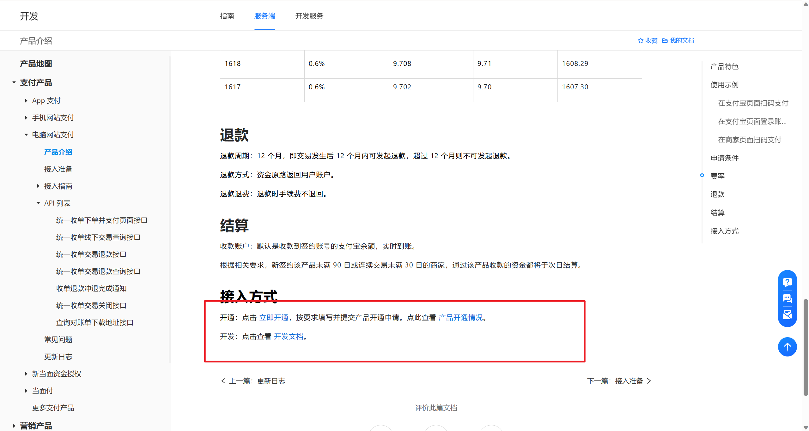
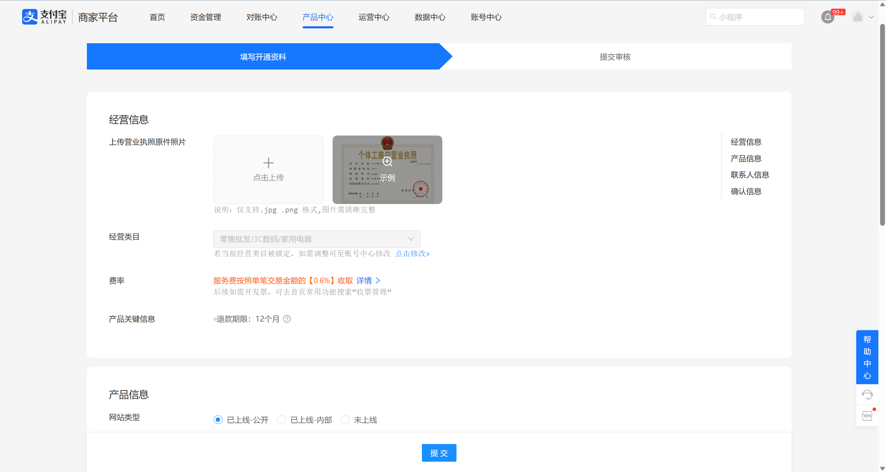
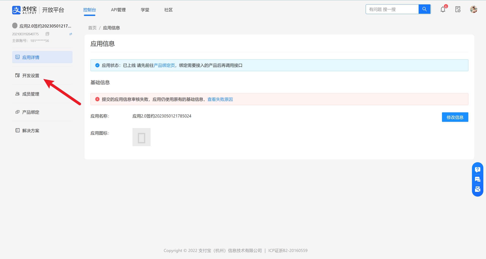
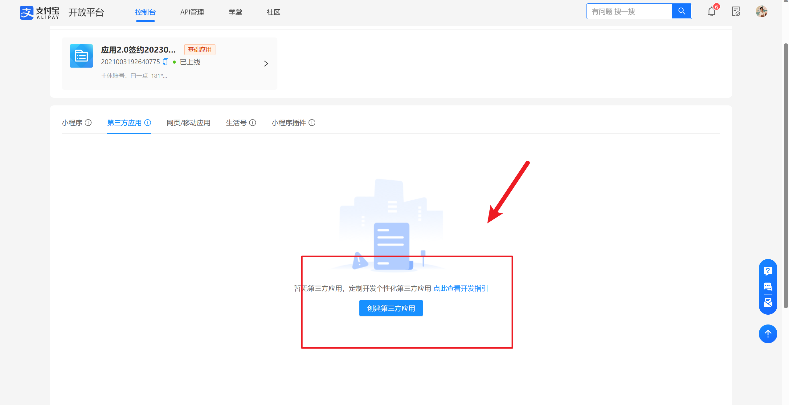
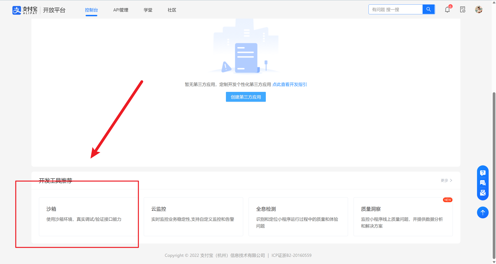
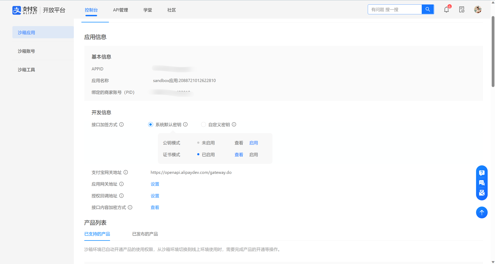
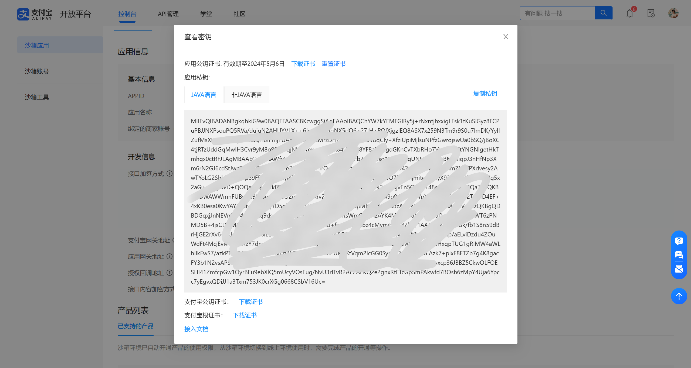
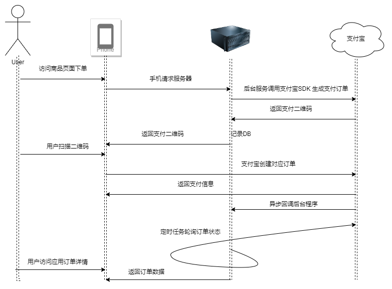

[TOC]

---
### 任务描述
前面的任务中，我们已经学习了，使用Go-zero框架搭建基本的RPC服务框架结构，以及使用Gorm实现基本的数据库ORM框架接入，下面这个关卡，我们就来实现商品模块的RPC服务

### 相关知识
- Go-Zero框架
- Protobuf文件的编写
- Gorm框架

### 重点介绍
#### 支付宝SDK对接
##### 支付宝创建
本关卡将会介绍如何对接支付宝SDK\
1. 打开支付宝:[申请成为开发者](https://open.alipay.com/) -> 申请个人在线支付[支付文档](https://opendocs.alipay.com/open/270/105898?pathHash=b3b2b667)<br>
点击下图进行，申请相关的接入权限:


下图资料页面可以不填写自己的相对应的营业执照，申请个人账户即可:


申请成功之后访问自己的控制台:[](https://open.alipay.com/develop/pm/sub/appinfo),检查是否存在支付宝已经创建的应用信息，如果没有出现，按照下面步骤进行创建应用.

回到自己的控制台:

选择创建三方应用，输入相关信息即可

2. 创建支付宝沙箱环境
进入自己的控制台首页，下拉，找到沙箱环境。


即可找到自己上面申请创建应用的沙箱环境，之后请开启图中的，接口加签方式为系统默认密钥，并且启用公钥私钥验证。


设置好之后，点击查看，下载自己的公钥私钥证书以及支付宝根证书。保存到自己电脑中。


##### 对接Go SDK
通过Go接入支付宝SDK
> SDK文档地址:[参考](https://github.com/smartwalle/alipay)

下面给出接入示例:
```go
// initAlipayClient
//
//	@Description: 初始化支付宝客户端
//	@param c
//	@return *alipay.Client
func initAlipayClient(c config.Config) *alipay.Client {
	privateKey, err := os.ReadFile(c.AliPay.AppPrivateKeyPath)
	if err != nil {
		panic(fmt.Sprintf("初始化支付渠道: 支付宝应用私钥失败:%v", err))
	}
	payClient, err := alipay.New(c.AliPay.AppId, string(privateKey), c.AliPay.IsProduction)
	// 加载应用公钥证书
	err = payClient.LoadAppPublicCertFromFile(c.AliPay.AppPublicCertPath)
	if err != nil {
		panic(fmt.Sprintf("初始化支付渠道: 加载应用公钥证书失败:%v", err))
	}
	// 加载支付宝根证书
	err = payClient.LoadAliPayRootCertFromFile(c.AliPay.ALiPayRootCertPath)
	if err != nil {
		panic(fmt.Sprintf("初始化支付渠道: 加载支付宝根证书失败:%v", err))
	}
	// 加载支付宝证书
	err = payClient.LoadAliPayPublicCertFromFile(c.AliPay.ALiPayPublicCertPath)
	if err != nil {
		panic(fmt.Sprintf("初始化支付渠道: 加载支付宝证书失败:%v", err))
	}
	return payClient
}

```

在上面的示例中，首先通过`alipay.New(c.AliPay.AppId, string(privateKey), c.AliPay.IsProduction)`创建的alipay对象，加载对应的支付宝公钥私钥以及根证书。<br>
下面通过简单的SDK调用创建支付宝交易订单(调用的接口为[](https://opendocs.alipay.com/open/02ekfg?scene=19)),这个接口将创建一个支付宝侧的支付二维码订单。

```go
func TestClient_TradePreCreate(t *testing.T) {
	t.Log("========== TradePreCreate ==========")
	var p = alipay.TradePreCreate{}
	p.OutTradeNo = "no_0001"
	p.Subject = "测试订单"
	p.TotalAmount = "10.10"

	rsp, err := client.TradePreCreate(p)
	if err != nil {
		t.Fatal(err)
	}
	if rsp.Content.Code != alipay.CodeSuccess {
		t.Fatal(rsp.Content.Msg, rsp.Content.SubMsg)
	}
	t.Log(rsp.Content.QRCode)
}
```
##### 订单创建
下面我们通过流程图说明，订单创建的过程:

在上图中，用户通过访问我们创建订单的接口，后台服务回去请求我们的支付宝接口，创建相对应的订单信息，之后将订单信息存储到数据库，并将从支付宝侧获取的
支付二维码返回给用户。当用户扫描二维码的时候，支付宝侧会自动创建订单，订单编号就是一开始我们请求支付宝时候返回的订单编号。之后当用户支付成功之后，
支付宝通过重定向返回到后台服务，后台服务将支付宝携带的参数进行存储，之后重定向到用户订单详情页面。
这样引出了一个问题，后台服务如何知晓订单状态？
解决方案如下:
1. 可以通过支付宝接口设置相对应的回调参数，当用户支付成功之后，支付宝会带上相对应的参数进行请求我们相关业务，之后业务去查询订单状态即可。
2. 支付宝侧虽然提供了订单状态消息推送的功能，但是由于网络原因常常有可能收不到支付宝的回调信息。因此可以通过支付宝提供的订单信息查询接口进行查询用户订单状态（定时轮询）

##### 订单删除
那么如何解决用户下单之后，不进行支付（订单超时问题）？
解决方案如下:
当用户下单之后，系统后台会创建对应的订数据，那么这个时候可以发送一个消息到消息队列中，并且设置对应消息被定时消费的时间，当时间到达之后，”消费者“就会对发送的消息
进行获取，之后带着相关数据查询支付宝，看用户是否支付，如支付则删除这个消息。如果未支付则先删除数据库订单记录设置状态，其次请求支付宝进行取消订单的操做。

#### 任务队列(消息队列)
##### 基本知识
> 资料: 
> 1. [亚马逊-消息队列](https://aws.amazon.com/cn/message-queue/)
> 2. [掘金-消息队列介绍](https://juejin.cn/post/6844903853737902094)
> 3. [项目使用的Async](https://github.com/hibiken/asynq)

上面我们说到了，可以使用消息队列，任务队列来实现，这里我们就简单介绍以下，什么是消息队列？<br>
FromAmazon:"消息队列是一种异步的服务间通信方式，适用于无服务器和微服务架构。消息在被处理和删除之前一直存储在队列上。每条消息仅可被一位用户处理一次。消息队列可被用于分离重量级处理、缓冲或批处理工作以及缓解高峰期工作负载。在现代云架构中，应用程序被分解为多个规模较小且更易于开发、部署和维护的独立构建块。消息队列可为这些分布式应用程序提供通信和协调。消息队列可以显著简化分离应用程序的编码，同时提高性能、可靠性和可扩展性。
借助消息队列，系统的不同部分可相互通信并异步执行处理操作。消息队列提供一个临时存储消息的轻量级缓冲区，以及允许软件组件连接到队列以发送和接收消息的终端节点。这些消息通常较小，可以是请求、恢复、错误消息或明文信息等。要发送消息时，一个名为“创建器”的组件会将消息添加到队列。消息将存储在队列中，直至名为“处理器”的另一组件检索该消息并执行相关操作。"<br>
通常意义上来讲，消息队列可以理解成为一个管道，里面有不同的`Topic`消息类型，并且消息管道也可以存在多个，这个存储消息的成为`broker`，在这个管道的两端分别存在消费者和生产者。
生产者通过生产不同Topic类型的消息发送到管道中，之后由消费者进行订阅不同Topic下的消息进行消费。理论上讲一个消息只能被消费一次，但是在不同消费队列的实现上面，需要具体情况具体分析，这里仅仅给出一个简单的解释<br>


##### 接入示例
客户端: `client.go`
```go
import (
    "github.com/hibiken/asynq"
    "context"
)

func main() {
    // 创建一个新的 asynq 客户端连接
    client := asynq.NewClient(asynq.RedisClientOpt{Addr: "localhost:6379"}) 
    defer client.Close()

	// 创建一个topic为send_email的任务，第二个参数是任务数据
    task := asynq.NewTask("send_email", []byte(`{"to": "example@example.com", "body": "Hello World!"}`))

    // 发送任务到队列中
    _, err := client.Enqueue(task) 
    if err != nil {
        // 处理错误
        return
    }
}

```

服务端:`server.go`
```go
import (
    "github.com/hibiken/asynq"
    "context"
    "fmt"
)

func main() {
    // 创建一个新的 asynq 服务器连接
    server := asynq.NewServer(asynq.RedisServerOpt{Addr: "localhost:6379"})
    defer server.Close()

    // 定义队列的处理函数
    server.HandleFunc("send_email", func(ctx context.Context, task *asynq.Task) error {
        // 从 task.Payload 字段中解码邮件发送数据
        var data struct { 
            To   string
            Body string
        }
		// json解码
        if err := json.Unmarshal(task.Payload(), &data); err != nil {
            // 处理解码失败
            return err
        }

        // 发送电子邮件
        err := sendEmail(data.To, data.Body)
        if err != nil {
            // 处理电子邮件发送失败
        }
        return nil
    })

    // 启动 asynq 处理程序
    if err := server.Run(); err != nil {
        // 处理错误
        fmt.Println(err)
    }
}

func sendEmail(to, body string) error {
    // 发送电子邮件的实现
    return nil
}
```
### 编程要求
#### 提示
注意：本关卡已经帮你生成了对应的RPC接口，你只需要补充RPC接口中的方法(loginc中)逻辑实现，以及下面任务点内容
- 原始的RPC接口定义为: `sources/apps/order/cmd/rpc/pb/orderrpc.proto`
- 原始的GORM生成配置为: `sources/apps/order/gen/generate_test.go`

下面为本关卡具体的项目结构:
├── etc
│   ├── cert
│   │   ├── alipayPublicCert.crt // 这里保存你的支付宝公钥证书
│   │   ├── alipayPublicCert.crt:Zone.Identifier
│   │   ├── alipayRootCert.crt // 这里存储你的支付宝根证书
│   │   ├── alipayRootCert.crt:Zone.Identifier
│   │   ├── appPrivateKey.txt // 这里存储你的支付宝app私钥
│   │   ├── appPublicCert.crt // 这里存储你的支付宝app公钥
│   │   └── appPublicCert.crt:Zone.Identifier
│   └── orderrpc.yaml
├── internal
│   ├── config
│   │   └── config.go // 配置类
│   ├── dao // 生成的持久层struct 查询逻辑
│   │   ├── order.gen.go
│   │   ├── order.gen_test.go
│   │   ├── query.go
│   │   ├── query_test.go
│   │   ├── user_earn.gen.go
│   │   └── user_earn.gen_test.go
│   ├── logic // 具体业务逻辑
│   │   ├── addorderlogic.go // 创建一个单一订单
│   │   ├── adduserearnlogic.go // 创建一个userEarn逻辑
│   │   ├── checkailpaystatuslogic.go // 检查阿里侧订单状况
│   │   ├── deleteorderalianddblogic.go  // 删除阿里侧订单和数据库订单数据
│   │   ├── delorderlogic.go // 删除订单数据(db)
│   │   ├── deluserearnlogic.go // 删除用户userEarn数据
│   │   ├── doorderlogic.go // 实际创建订单，请求支付宝，入db的逻辑
│   │   ├── getorderbyidlogic.go // 通过订单id查询订单
│   │   ├── getorderinfobyuseridandproductidlogic.go // 通过用户id和商品Id查询用户订单数据
│   │   ├── getorderinfobyuuidanduseridlogic.go // 查询订单详细信息，通过订单的uuid和用户的id
│   │   ├── getorderstatusbyuuidlogic.go // 通过订单uuid查询数据库订单状态
│   │   ├── getorderuuidbylimitandstatuslogic.go // 通过订单状态批量获取订单Uuid
│   │   ├── getproductbindandpriceslogic.go // 获取顶大绑定的商品和价格
│   │   ├── getuserearnbyidlogic.go // 通过id查询用户userEarn
│   │   ├── searchorderbyconditionlogic.go // 条件检索订单数据
│   │   ├── searchuserearnbyconditionlogic.go // 条件检索用userEarn
│   │   ├── updateorderlogic.go // 更新订单数据
│   │   ├── updateorderstatuslogic.go // 更新订单状态
│   │   └── upsertuserearnlogic.go // 更新userEarn
│   ├── model // 数据库实体对象
│   │   ├── order.gen.go
│   │   └── user_earn.gen.go
│   ├── server // rpc服务器
│   │   └── orderrpcserver.go
│   └── svc // 服务上下文
│       └── servicecontext.go
├── orderrpc // 服务请求的rpc客户端
│   └── orderrpc.go
├── orderrpc.go // 主程序
└── pb // protobuf文件
├── orderrpc.pb.go // protobuf对应的Go数据结构
├── orderrpc.proto // protobuf源文件
└── orderrpc_grpc.pb.go // 生成的grpc服务代码

#### 任务
**请按照下面步骤，修改完成相对应的CURD方法(logic)**
1. 请修改`sources/apps/order/cmd/rpc/etc/orderrpc.yaml`配置文件中数据库以及Redis链接如下:

| 类别    | 用户名  | 密码     | 端口   | 地址        |
|-------|------|--------|------|-----------|
| Redis | 空    | 空      | 6879 | 127.0.0.1 |
| Mysql | root | 123123 | 3306 | 127.0.0.1 |

2. 请修改配置文件`sources/apps/order/cmd/rpc/etc/orderrpc.yaml`，添加下面配置。(需要完成前面的TradeRPC服务!!!)
```yaml
TradeRpcConfig:
  Endpoints:
    - 127.0.0.1:8012 
```
3. 请初始化对应的Async消息队列客户端在`sources/apps/order/cmd/rpc/internal/svc/servicecontext.go`服务上下文中，示例如下
```go
type ServiceContext struct {
	Config       config.Config
	Query        *dao.Query
	RedisClient  *redis.Redis
	// 上下文对象中声明，async客户端
	AsynqClient  *asynq.Client
}
func NewServiceContext(c config.Config) *ServiceContext {
// init
    rd := initRedisClient(c)
    return &ServiceContext{
        Config:       c,
        Query:        // 初始化你的dao查询结构 initDaoQuery(c)，可以参照前面章节的servicecontext.go 中的写法，请注意包顺序,
        RedisClient:  // 上述同理，参考前面章节的servicecontext.go,
		// 初始化客户端
        AsynqClient:  initAsyncClient(c),
    }
}
// initAsyncClient
//
//	@Description: 初始化 https://github.com/hibiken/asynq 异步任务队列客户端初始化
//	@param c
//	@return *asynq.Client
func initAsyncClient(c config.Config) *asynq.Client {
    return asynq.NewClient(asynq.RedisClientOpt{
	    Addr:     c.Redis.Host,
        Password: c.Redis.Pass,
    })
}
```
4. 初始化连接前面关卡的(`trade`)服务，下面给出连接示例
- 修改配置文件，增加Example服务的连接地址:
```yaml
ExampleConfig:
  Endpoints:
    - 127.0.0.1:8012
```

- 修改配置映射类的`config.go`文件
```go
type Config struct {
	zrpc.RpcServerConf
	DataSource string
	ExampleConfig zrpc.RpcClientConf
}
```

- 修改服务上下文`servicecontext.go`
```go
type ServiceContext struct {
	Config       config.Config
	Query        *dao.Query
	ExampleRPC     example.ExampleRPC
}

func NewServiceContext(c config.Config) *ServiceContext {
// init
    return &ServiceContext{
        Config:       c,
        ExampleRPC:     example.NewExampleRPC(zrpc.MustNewClient(c.ExampleConfig)),
        }
}
```
经过上面几个步骤，就可以将ExampleRPC服务接入到该服务中，下面给出调用方法示例:
```go
func (l *XXXXLogic) DoOrder(in *pb.ExampleGetData) (*pb.DoOrderResp, error) {
	// 创建超时的context， 这里可以使用工具类提供的默认超时时间，实现
    deadline, cancelFunc := context.WithTimeout(context.Background(), utils.GetContextDuration())
    defer cancelFunc()
	// 这里调用服务上下文中的ExampleRPC，中的GetExampleById方法，分别传入上下文、数据
    product, err := l.svcCtx.ExampleRPC.GetExampleById(deadline, &example.GetGetExampleByIdReq{
        ID: in.Id,
    })
	retunrn nil,nil
}
```

4. 编写实现基本的数据库增删改查接口，需要完成实现的接口查询逻辑如下(逻辑意义请参照上述项目结构中注释)
```text
├── addorderlogic.go
├── adduserearnlogic.go
├── checkailpaystatuslogic.go
├── deleteorderalianddblogic.go
├── delorderlogic.go
├── deluserearnlogic.go
├── doorderlogic.go
├── getorderbyidlogic.go
├── getorderinfobyuseridandproductidlogic.go
├── getorderinfobyuuidanduseridlogic.go
├── getorderstatusbyuuidlogic.go
├── getorderuuidbylimitandstatuslogic.go
├── getproductbindandpriceslogic.go
├── getuserearnbyidlogic.go
├── searchorderbyconditionlogic.go
├── searchuserearnbyconditionlogic.go
├── updateorderlogic.go
├── updateorderstatuslogic.go
└── upsertuserearnlogic.go
```
提示: 请注意下面接口的编写(需要用到的对接方法，以及相关知识在上述重点介绍中已给出，请自行查阅相关文档实现。)
1. doorderlogic: 这个接口中首先需要创建用户订单 -> 存储数据 -> 请求支付宝 -> 保存请求状态 -> 响应数据
2. deleteorderalianddblogic: 删除支付宝订单 -> 更新数据库 -> 响应
3. checkailpaystatuslogic: 直接请求删除支付宝订单

开发提示:
**接口中入参和出参数，均可在`sources/apps/order/cmd/rpc/pb/orderrpc.proto`proto文件中定义找到，编辑器中也可以查看相对应的proto数据类型定义。**<br>
**数据库GO模型，请在`sources/apps/order/cmd/rpc/internal/model`中进行查阅**<br>
**数据上下文设置，请查看`sources/apps/order/cmd/rpc/internal/svc/servicecontext.go`里面进行了数据库、Redis的初始化工作**<br>


### 测试说明
测试前提: 平台会编译前面任务完成的`trade`服务的RPC服务，之后启动当前关卡的服务进行测评<br>
请在完成**所有接口**之后，在进行评测，平台会评测上述要求中的**部分接口**，**其结果可以满足平台进行增删改查配置的标准输入输出时，视为通过测评，否则不给予通过**
会被评测的接口内容如下:
- pb.orderrpc.DoOrder
- pb.orderrpc.GetOrderById


注：如需自己测试自己服务是否编写正常，可以使用`go run`命令自行运行主程序`sources/apps/order/cmd/rpc/orderrpc.go`，或者使用在线编译器进行调试。通过`grpcurl`测试自己的RPC服务接口
> `grpcurl`参考: [掘金-使用 grpcurl 通过命令行访问 gRPC 服务](https://juejin.cn/post/7013612865823178782)
> 查询你服务的RPC接口:`grpcurl -plaintext host:port list` 注意务必开启反射:`reflection.Register(grpcServer)`