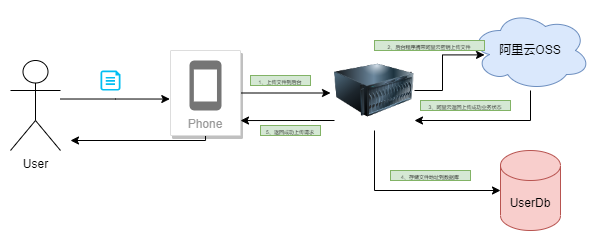

[TOC]

---
### 任务描述
恭喜你，已经完成了项目的基本RPC框架逻辑的编写，学习了Go-Zero API服务的桩代码生成，Go-Zero RPC服务的桩代码生成等项目基础技术点，下面下面我们开始正式进入API服务的编写.<br>


### 相关知识
- JSON
- Golang
- Protobuf
- Go-Zero

### 难点介绍
#### 文件上传OSS
根据前面我们划分的微服务体系，在这里我们主要与RPC服务进行通讯，其次根据设计我们的用户头像与文件均需要存储在阿里云的OSS上面，下面来简单介绍一下实际代码的处理逻辑:



根据上图所示，我们整个上传逻辑其实实在服务端完成的，目前常见的两种文件上传方案为:
1. 前端上传: 这里主要请求后端的接口，获取相对应的OSS云签名，之后携带签名进行直接由浏览器上传到云端
2. 后端上传: 这里主要是前端通过将文件直接上传到后端的服务器上，之后由后端的服务器对文件进行分析处理，之后在上传到云端

两种方式根据实际业务环境进行调整，从数据安全角度来看，第二种方法更利于对于文件实际的字节流进行校验，保证上传数据真实安全，但是相对来说耗时较大。
#### 用户验证码 生成 && 校验
常见的用户系统通常包含前台的验证码校验和后台的验证码校验，这是接口防刷的重要手段，验证码的生成可以自行生成实现也可以使用工具包生成。<br>
本项目采用了工具包来完成验证码的创建和比对，下面就两种方法进行一一介绍。<br>
1. 第一种: 可以提供一个接口，接口中主要通过随机字符或者随机数字的产生生成对应的验证码ID和CODE,之后将这组ID,CODE存储与Redis或者内存缓存或者其他缓存中间件中。<br>
之后返回前端数据。当前端进一步请求的时候带上指定的验证码数据即可，由后台从Redis或者缓存中间件中取出，进行比对即可。当然也可以通过将生成的CODE进行bas64图片转化<br>
返回图片数据给前端。
2. 第二种: 实际上实现原理与第一种相同，只是通过验证码工具类进行封装。下面介绍一下[base64Captcha](https://mojotv.cn/go/refactor-base64-captcha)
这是一个用Golang实现的快速生成校验验证码的仓库，下面介绍摘录自[作者博客](https://mojotv.cn/go/refactor-base64-captcha)
- 生成Base64(image/audio)验证码字符串
```go
//Generate generates a random id, base64 image string or an error if any
func (c *Captcha) Generate() (id, b64s string, err error) {
    id,content, answer := c.Driver.GenerateIdQuestionAnswer()
    item, err := c.Driver.DrawCaptcha(content)
    if err != nil {
        return "", "", err
    }
    c.Store.Set(id, answer)
    b64s = item.EncodeB64string()[user.api](..%2F..%2F..%2Fsources%2Fapps%2Fuser%2Fcmd%2Fapi%2Fdec%2Fuser.api)
    return
}
```
- 校验验证码内容 
```go
//if you has multiple captcha instances which shares a same store. You may want to use `store.Verify` method instead.
//Verify by given id key and remove the captcha value in store, return boolean value.
func (c *Captcha) Verify(id, answer string, clear bool) (match bool) {
    match = c.Store.Get(id, clear) == answer
return
```

在本项目中，我已经将这个验证码实现进行了封装(实现可查看:`sources/apps/user/cmd/api/internal/common/captcha.go`)，使用时候直接在`servicecontex.go`中进行初始化即可，下面给出初始化用例:
```go
// servicecontext.go
package svc

import (
	"errors"

	"github.com/baiyz0825/school-share-buy-backend/apps/user/cmd/api/internal/common"
	"github.com/baiyz0825/school-share-buy-backend/apps/user/cmd/api/internal/config"
	"github.com/baiyz0825/school-share-buy-backend/apps/user/cmd/rpc/userrpc"
	"github.com/baiyz0825/school-share-buy-backend/common/utils"
	"github.com/mojocn/base64Captcha"
	"github.com/zeromicro/go-zero/core/stores/redis"
	"github.com/zeromicro/go-zero/zrpc"
)

type ServiceContext struct {
	Config      config.Config
	RedisClient *redis.Redis
	// 验证码实现类
	Captcha     *base64Captcha.Captcha
	UserRpc     userrpc.Userrpc
	Validator   *utils.Validator
	OSSClient   *utils.OSSClient
}

func NewServiceContext(c config.Config) *ServiceContext {
	// init
	rd := initRedisClient(c)
	// 从工具类初始化验证码
	captcha := common.InitCaptcha(rd)
	return &ServiceContext{
		Config:      c,
		RedisClient: rd,
		Captcha:     captcha,
		UserRpc:     userrpc.NewUserrpc(zrpc.MustNewClient(c.UserRpcConfig)),
		Validator:   utils.GetValidator(),
		OSSClient:   utils.InitOssClient(c.AliCloud.AccessKeyId, c.AliCloud.AccessKeySecret, c.AliCloud.EndPoint, c.AliCloud.BucketName),
	}
}

// 初始化redis
func initRedisClient(c config.Config) *redis.Redis {
	// 创建 Redis 配置
	r := redis.MustNewRedis(c.Redis)
	if r != nil {
		return r
	}
	panic(errors.New("初始化Redis失败"))
}

```
调用方法:
```go
// 生成验证码
func (l *CaptchaLogic) Captcha() (resp *types.ChaptchaResp, err error) {
    captchaId, captcha, err := l.svcCtx.Captcha.Generate()
    if err != nil {
        return nil, xerr.NewErrCode(xerr.CAPTCHA_GEN_ERR)
    }

	return &types.ChaptchaResp{
        CaptchaB64: captcha,
        CaptchaId:  captchaId,
    }, nil
}
// 校验验证码
func Verfirty(req *types.RegisterReq) bool  {
    if !l.svcCtx.Captcha.Verify(req.CaptchaId, req.Captcha, true) {
        return false
    }
}

```
#### 接口校验
对于Web项目，后端程序在任何时候都不能信任前端传递过来的相对应的接口数据，需要对接口进行不同程度的接口参数校验。本项目中使用了[validator](https://github.com/go-playground/validator)<br>
进行接口程序的校验，只需要在结构体tag上加上相对应的接口校验规则即可，也可传入自定义的校验规则。由于本项目是基于Go-zero框架，因此在定义校验规则tag的<br>
时候，在相应的Api文件上进行修改即可，之后生成的接口结构体中就会带上这个字段。<br>
下面通过一个例子来了解一下基本使用方法:
1. 编写APi文件
```api
type(
    // 用户登陆请求
    LoginReq {
        // 手机号 zh_cn_phone自定义校验规则
        Phone string `form:"phone" validate:"required,zh_cn_phone"`
        // 邮箱 omitempty 没传就忽略
        Email string `form:"email,optional" validate:"omitempty,email"`
        // 密码 自定义password校验
        Password string `form:"password" validate:"required,password"`
        // 验证码
        Captcha string `form:"captcha" validate:"required"`
        // 验证码id
        CaptchaId string `form:"captchaId" validate:"required"`
    }
)

```
2. 生成对应的接口桩代码，查看对应的接口结构体，如下
```go
type RegisterReq struct {
	Username  string `form:"username" validate:"required"`
	Password  string `form:"password" validate:"required,password"`
	Phone     string `form:"phone" validate:"required,zh_cn_phone"`
	Captcha   string `form:"captcha" validate:"required"`
	CaptchaId string `form:"captchaId" validate:"required"`
}
```

3. 配置校验器
```go
package utils

import (
	"fmt"
	"regexp"
	"strings"

	"github.com/go-playground/locales/zh"
	ut "github.com/go-playground/universal-translator"
	"github.com/go-playground/validator/v10"
	zh_translations "github.com/go-playground/validator/v10/translations/zh"
)

// Validator 参数校验器
type Validator struct {
	Validator *validator.Validate
	Uni       *ut.UniversalTranslator
	Trans     map[string]ut.Translator
}

// GetValidator
// @Description: 获取参数校验器
// @return *Validator
func GetValidator() *Validator {
	v := Validator{}
	translator := zh.New()
	v.Uni = ut.New(translator, translator)
	v.Validator = validator.New()
	zhTrans, _ := v.Uni.GetTranslator("translator")
	v.Trans = make(map[string]ut.Translator)
	v.Trans["translator"] = zhTrans

	err := v.Validator.RegisterValidation("password", passwordValidation)
	if err != nil {
		panic(fmt.Sprintf("校验器注册错误：%v", err))
	}
	// 自定义翻译消息
	_ = v.Validator.RegisterTranslation("password", zhTrans, func(ut ut.Translator) error {
		return ut.Add("password", "{0}密码必须以字母开头，长度在6~18之间，只能包含字母、数字和下划线", true)
	}, func(ut ut.Translator, fe validator.FieldError) string {
		t, _ := ut.T("password", fe.Field())
		return t
	})
	err = v.Validator.RegisterValidation("zh_cn_phone", chinesePhoneValidation)
	if err != nil {
		panic(fmt.Sprintf("校验器注册错误：%v", err))
	}
	// 自定义翻译消息
	_ = v.Validator.RegisterTranslation("zh_cn_phone", zhTrans, func(ut ut.Translator) error {
		return ut.Add("zh_cn_phone", "{0}请填写中国手机号", true)
	}, func(ut ut.Translator, fe validator.FieldError) string {
		t, _ := ut.T("zh_cn_phone", fe.Field())
		return t
	})
	err = zh_translations.RegisterDefaultTranslations(v.Validator, zhTrans)
	if err != nil {
		return nil
	}
	return &v
}

// ValidateZh
// @Description: 中文校验返回错误信息翻译
// @receiver v
// @param data
// @param lang
// @return string
func (v *Validator) ValidateZh(data interface{}) string {
	err := v.Validator.Struct(data)
	if err == nil {
		return ""
	}

	errs, ok := err.(validator.ValidationErrors)
	if ok {
		transData := errs.Translate(v.Trans["zh"])
		s := strings.Builder{}
		for _, v := range transData {
			s.WriteString(v)
			s.WriteString(" ")
		}
		return s.String()
	}

	invalid, ok := err.(*validator.InvalidValidationError)
	if ok {
		return invalid.Error()
	}

	return ""
}

// passwordValidation
// @Description: 自定义密码校验器 -> 密码必须以字母开头，长度在6~18之间，只能包含字母、数字和下划线
// @param fl
// @return bool
func passwordValidation(fl validator.FieldLevel) bool {
	password := fl.Field().String()
	// 密码必须以字母开头，长度在6~18之间，只能包含字母、数字和下划线
	pattern := `^[a-zA-Z]\w{5,17}$`
	match, _ := regexp.MatchString(pattern, password)
	return match
}

// chinesePhoneValidation
// @Description: 中国手机号校验
// @param fl
// @return bool
func chinesePhoneValidation(fl validator.FieldLevel) bool {
	phone := fl.Field().String()
	// 中国手机号格式为11位数字，以1开头
	pattern := `^(13[0-9]|14[01456879]|15[0-35-9]|16[2567]|17[0-8]|18[0-9]|19[0-35-9])\d{8}$`
	match, _ := regexp.MatchString(pattern, phone)
	return match
}

```

4. 注册校验器到`servicecontext.go`
```go
type ServiceContext struct {
	Config      config.Config
	Validator   *utils.Validator
}
func NewServiceContext(c config.Config) *ServiceContext {
// init
    return &ServiceContext{
        Config:      c,
		// 注册校验器
        Validator:   utils.GetValidator(),
    }
}
```

5. 使用
```go
	// 解析请求参数
	func Example(req *types.RegisterReq){
        if validatorResult := l.svcCtx.Validator.ValidateZh(req); len(validatorResult) > 0 {
        return false
    }
}

```
当校验规则不通过的时候，会自动返回响应的错误信息，之后由框架进行封装返回。如需要学习更多校验器的相关知识，请自行阅读[Go 使用validator进行后端数据校验](https://juejin.cn/post/6847902214279659533)
#### MultipleFile文件解析
> 更多参考:[Go-multipart 最佳实践](https://gufeijun.com/post/httpframe/5/)
1. multipart.FileHeader
   multipart.FileHeader代表文件上传时的头信息，其中包括文件名、文件大小、MIME类型等，可以通过该结构体获取上传的文件的各种信息。
   主要有以下属性：
- Filename：文件名
- Size：文件大小
- Header：文件头
- ContentType：文件类型

通过multipart.FileHeader可以实现多种功能，例如：
- 获取文件名：f.Header.Filename
- 获取文件大小：f.Header.Size
- 获取文件类型：f.Header.ContentType

2. multipart.File
   multipart.File代表一个上传的文件，可以通过该结构体对上传的文件进行操作，比如读取文件内容、保存文件等。
   multipart.File主要有以下方法：
- Read：读取文件内容
- Seek：移动文件指针
- Close：关闭文件

通过multipart.File可以实现多种功能，比如：
- 读取文件内容：io.Copy(dst, f)
- 将文件保存到本地：io.Copy(dstFile, f)

### 编程要求
#### 提示
1. 针对目前上面所示:
- OSS客户端:`sources/common/utils/oss_utils.go`
- 校验器规则:`sources/common/utils/validator_utils.go`
- 验证码生成工具类:`sources/apps/user/cmd/api/internal/common/captcha.go`
- 返回的常量信息为`sources/common/xerr/businessErr.go`和`sources/common/xerr/xerr_code.go`请直接调用即可

项目均已经实现，请补充Logic部分完成业务逻辑即可，部分使用方法一在上面给出示例，未给出的请参考工具类方法进行使用。

2. 上传文件解析: 由于Go-zero框架本身没有实现响应的文件解析，因此我们需要手动实现文件的上传解析，下面给出一个具体示例:<br>

- 从`http.Request`解析对应上传文件的key: 假如前端上传的表单中文件key为: `avatar`
```go
func UploadUserAvatarHandler(svcCtx *svc.ServiceContext) http.HandlerFunc {
	// 注册的回调函数
	return func(w http.ResponseWriter, r *http.Request) {
		l := user.NewUploadUserAvatarLogic(r.Context(), svcCtx)
		// avatar不为空，处理头像，这里通过ParseMultipartForm来检查上传的文件大小
		err := r.ParseMultipartForm(64 << 20) // 32MB
		if err != nil {
			// 处理错误信息
			respresult.ApiResult(r, w, nil, xerr.NewErrMsg("文件超过限制，请上传64M以下文件，格式为常见图片格式"))
		}
		// 从这里获取表单中提交的用户头像信息
		file, header, err := r.FormFile("avatar")
		if err != nil && err != http.ErrMissingFile {
			respresult.ApiResult(r, w, nil, xerr.NewErrMsg("服务器异常，请稍后重新上传用户头图"))
		}
		// 最后使用defer在函数调用结束之后关闭file方式内存泄露
		defer func(file multipart.File) {
			err := file.Close()
			if err != nil {

			}
		}(file)
		// 将解析的文件存储到服务上下文svcCtx *svc.ServiceContext，方便后面服务获取
		l.AvatarFile = file
		l.AvatarFileHeader = *header
		// 这里执行你实际的业务逻辑处理方法
		err = l.UploadUserAvatar() 
		// 通过工具类返回对应的http请求数据
		respresult.ApiResult(r, w, nil, err)
	}
}
```
- 实际处理头像函数`l.UploadUserAvatar()`
```go
func (l *UploadUserAvatarLogic) UploadUserAvatar() error {
	// 从上下文获取用户头像文件 l.AvatarFile
	fileContent, err := io.ReadAll(l.AvatarFile)
	if err != nil {
		return xerr.NewErrMsg("文件内容读取失败")
	}
	defer func(AvatarFile multipart.File) {
		err := AvatarFile.Close()
		if err != nil {

		}
	}(l.AvatarFile)
	// 其他逻辑
	return nil
}
```
#### 任务
**请按照下面步骤，修改完成相对应的方法(logic)**
1. 修改配置文件: `sources/apps/user/cmd/api/etc/userrpc.yaml`，修改其中AliCloud部分，配置自己对应的阿里云密钥和账户信息
2. 修改`servicecontext.go`注册对应的rpc服务(userRpc)
3. 编写实现login中的接口
```text
├── major
│   └── getallmajorslogic.go
└── user
    ├── captchalogic.go // 获取表单验证码
    ├── loginlogic.go // 登陆逻辑
    ├── modinfologic.go // 修改用户信息
    ├── registerlogic.go // 用户注册
    ├── uploaduseravatarlogic.go // 上传用户头像
    └── userinfologic.go // 查询用户详情
```

4. 在编写逻辑的时候，请不要在用户登陆与注册中加入验证码校验(方便平台测评)，但是验证码生成接口请正常实现
### 测试说明
测试前提: 平台会编译前面任务完成的`user`服务的RPC服务，之后启动当前关卡的服务进行测评<br>
请在完成**所有接口**之后，在进行评测，平台会评测上述要求中的**部分接口**，**其结果可以满足平台进行增删改查配置的标准输入输出时，视为通过测评，否则不给予通过**
会被评测的接口内容如下:
- `/user/v1/info`
- `/user/v1/captcha`
- `/user/v1/info`
注：如需自己测试自己服务是否编写正常，可以使用`go run`命令自行运行主程序,并且启动自己对应依赖的远程RPC服务，或者使用在线编译器进行调试。通过`curl`测试自己的API服务接口