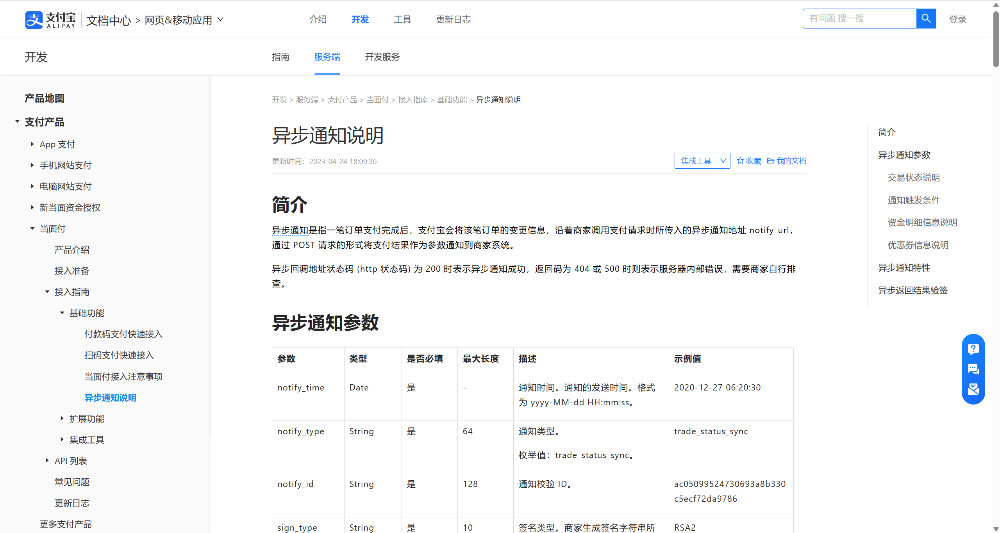

[TOC]

---
### 任务描述
在本关卡，我们将编写Resources-API服务，这个服务主要负责将RPC中的数据转化为API接口形式，并且加上相关权限检查，返回。其次在本服务中我们将，与阿里云OSS进行对接，将文件传输存储在云端。
### 相关知识
- JSON
- Golang
- Protobuf
- Go-Zero
- Golang Routine

### 重点
#### 支付宝订单信息回调
在前面的RPC服务中，我们编写了基本的向支付宝提交订单的逻辑方法，并且提到了，订单状态更新的两种办法，这里我们实现第一种办法，接受支付宝的订单回调。<br>
当系统成功向支付宝提交订单之后，支付宝侧会创建订单信息，之后返回对应的二维码信息。用户通过扫描二维码向支付宝支付。支付宝内部存在订单状态监听接口，当用户订单支付、未支付、取消等。<br>
均会向创建订单时发送的消息回调地址发送一个Post请求，传输相对应的订单数据变更。<br>
文档:[支付宝](https://opendocs.alipay.com/open/194/103296)


#### 订单详细信息查询
当用户需要查询详细订单数据的时候，应该不仅仅获取订单的记录，也需要填充订单绑定的卖家（资源发布者）、资源名称等必要参数。因此在这个业务场景下，这是一个长查询，请自行调用不同的RPC服务进行实现。
### 编程要求
#### 提示
1. 请检查配置文件中，服务配置是否一致:
```yaml
OrderRpcConfig:
  Endpoints:
    - 0.0.0.0:8010
ResourcesRpcConfig:
  EndPoints:
    - 0.0.0.0:8011
UserRpcConfig:
  Endpoints:
    - 0.0.0.0:8013
TradeRpcConfig:
  Endpoints:
    - 0.0.0.0:8012
```
2. 配置对应的阿里云配置 && Redis配置，具体配置样例在前面的关卡中以及举例说明，这里不在赘述
#### 任务
请补充实现下列接口数据:
```text
├── aliCallback // 阿里云回调
│   └── alipaynoticecallbacklogic.go // 阿里云订单状态回调接口
└── order
    ├── doorderlogic.go // 下单接口
    ├── getorderinfologic.go // 获取订单详情信息(这里的payOrderNum与订单uuid保持一致！)
    └── getuserallorderlogic.go // 获取用户所有订单信息
```

### 测试说明
测试前提: 平台会编译前面任务完成的`user-rpc`、`resource-rpc`,`order-rpc`,`trade-rpc`服务，之后启动当前关卡的服务进行测评<br>
请在完成**所有接口**之后，在进行评测，平台会评测上述要求中的**部分接口**，**其结果可以满足平台进行增删改查配置的标准输入输出时，视为通过测评，否则不给予通过**
会被评测的接口内容如下:
- `/order/do`
- `/order/info`