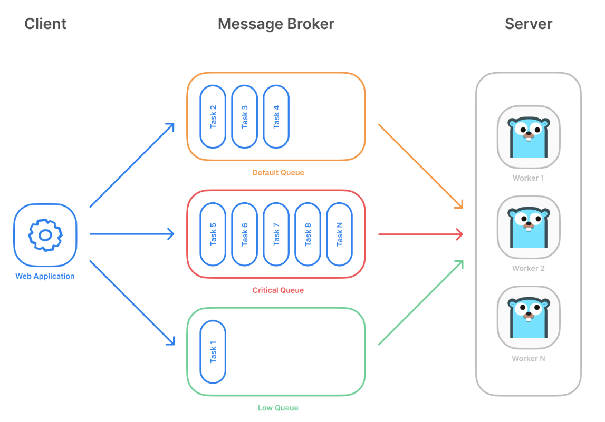
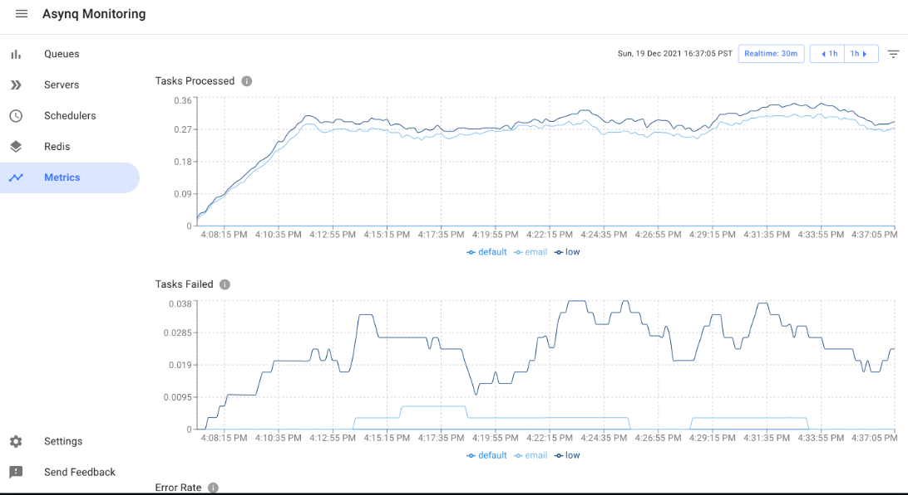
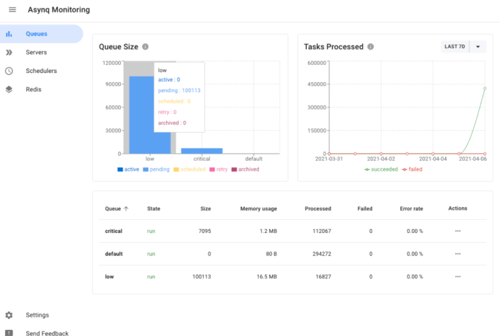

[TOC]

---
### 任务描述

### 相关知识
- JSON
- Golang
- Protobuf
- Go-Zero
- Golang Routine

#### 定时任务
##### 简单示例
在日常的开发中，定时任务是指在指定的时间或者时间间隔内执行指定的任务，通常用于定时执行一些重复性的任务或者定期对数据进行操作。
他的使用可以让我们的应用程序自动化地执行一些重复性的操作如备份数据、日志轮换、定时发送邮件等。
使用golang实现一个定时任务可以使用标准库中的time包，通过time.NewTimer() 或者 time.NewTicker() 函数创建计时器或者定时器。<br>
然后将想要执行的任务放在一个函数中，通过goroutine启动一个协程，在指定时间间隔内执行指定的任务即可。下面给出一个示例:

```go
package main

import (
    "fmt"
    "time"
)

func main() {
    ticker := time.NewTicker(time.Second * 1)
    go func() {
        for range ticker.C {
            fmt.Println("Hello, World")
        }
    }()

    time.Sleep(time.Second * 5)
    ticker.Stop()
    fmt.Println("Ticker stopped")
}
```
在上面的代码中，我们使用time.NewTicker()函数创建一个计时器，指定时间间隔为1秒，然后通过一个协程在指定时间间隔内执行打印“Hello, World”任务，最后通过time.Sleep()函数暂停5秒，然后停止计时器。
##### Asynq实现定时任务
###### 介绍
> [asynq](https://github.com/hibiken/asynq)

下面我们先来介绍asynq任务框架:(摘录自官方文档)


基本功能:
- 保证至少执行一项任务
- 任务调度
- 重试失败的任务
- 在工作接管情况下自动恢复任务
- 加权优先级队列
- 严格优先级队列
- 由于Redis中写入速度快，添加任务的延迟较低
- 使用唯一选项去重任务
- 允许为每个任务设置超时和截止时间
- 允许将一组任务聚合到批量多个连续操作中
- 灵活的处理程序接口，支持中间件
- 能够暂停队列以停止处理来自队列的任务
- 周期性任务
- 支持Redis Cluster自动分片和高可用性
- 支持Redis Sentinel高可用性
- 与Prometheus集成以收集和可视化队列指标
- Web UI检查和远程控制队列和任务
- CLI检查和远程控制队列和任务


从上面的结构图中我们可以看出，一个完整的任务队列包含三部分:
- 生产者: 客户端，主要生产不同Topic类型的任务队列数据，提交到对应的Topic存储
- 消费者: 服务端，监听自己需要监听的Broker之后进行获取数据处理
- Broker: 存储临时任务数据，携带任务要求充当媒介
###### 可视化面板
> 可视化面板:[](https://github.com/hibiken/asynqmon)





###### 基本示例
首先创建一个异步任务处理程序，它将在任务执行时被调用。然后，我们创建一个异步任务处理器并启动它。 接下来，创建一个新的定时任务，它将在10秒后执行，然后将其发送到异步任务队列中。<br>
最后，我们在异步任务处理程序中定义了任务执行时的逻辑，这里是简单地打印当前时间。
```go
package main

import (
	"context"
	"fmt"
	"time"

	"github.com/hibiken/asynq"
)

func main() {
	// 创建异步任务处理程序
	handler := asynq.HandlerFunc(processTask)

	// 创建异步任务处理器并启动
	server := asynq.NewServer(asynq.RedisClientOpt{Addr: "localhost:6379"}, handler)
	server.ListenAndServe()

	// 创建一个定时任务并将其发送到异步任务队列中
	task := asynq.NewTask("timer", nil)
	enqueued, err := asynq.EnqueueAt(time.Now().Add(10*time.Second), task)
	if err != nil {
		fmt.Println("Error enqueueing task:", err)
		return
	}
	fmt.Println("Task enqueued:", enqueued.ID)
}

func processTask(ctx context.Context, task *asynq.Task) error {
	fmt.Println("Task executed at:", time.Now())
	return nil
}
```

##### 创建服务(Scheduler生产者)
> 在前面的订单服务中，我们其实以及完成了一个订单过期删除的延迟任务提交，这里我们开发一个用户数据的轮询任务调度器，用来帮我们按照时间去轮询我们的订单信息将消费情况进行统计(UserEarn)
上面我们通过一个简单的示例，了解了基本的asynq的基本使用方法，下面我们将通过封装基本逻辑实现一个asynq的服务:
1. 创建对应的服务结构
```text
├── etc
│   └── scheduler.yaml // 配置文件
├── internal
│   ├── config // 配置类
│   │   └── config.go
│   ├── logic  // 业务逻辑
│   │   ├── jobs.go // 注册方法，类似注册路由
│   │   └── updateuserearnlogic.go // 实际业务
│   └── svc
│       └── servicecontext.go // 服务上下文对象
└── scheduler.go // 主程序

```

2. 创建服务上下文对象
```go
package svc

import (
	"time"

	"github.com/baiyz0825/school-share-buy-backend/apps/mq/cmd/scheduler/internal/config"
	"github.com/hibiken/asynq"
	"github.com/zeromicro/go-zero/core/logx"
)

type ServiceContext struct {
	Config    config.Config
	Scheduler *asynq.Scheduler
}

// 初始化一个任务调度上下文，便于存储任务数据
func NewServiceContext(c config.Config) *ServiceContext {
	return &ServiceContext{
		Config:    c,
		Scheduler: initScheduler(c),
	}
}

// 初始化定时任务框架
func initScheduler(c config.Config) *asynq.Scheduler {
	location, _ := time.LoadLocation("Asia/Shanghai")
	return asynq.NewScheduler(
		asynq.RedisClientOpt{
			Addr:     c.Redis.Host,
			Password: c.Redis.Pass,
		}, &asynq.SchedulerOpts{
			Location: location,
			// 任务enqueue回调
			PostEnqueueFunc: func(info *asynq.TaskInfo, err error) {
				logx.Infof("开始处理任务：%v", info)
			},
		})
}

```

3. 创建配置类
```go
package config

import (
	"github.com/zeromicro/go-zero/core/service"
	"github.com/zeromicro/go-zero/core/stores/redis"
)

type Config struct {
	service.ServiceConf
	Redis redis.RedisConf
}
```

4. 注册任务服务
```go
package logic

import (
	"context"

	"github.com/baiyz0825/school-share-buy-backend/apps/mq/cmd/scheduler/internal/svc"
)

// 定时任务调度器
type MqScheduler struct {
	ctx    context.Context
	svcCtx *svc.ServiceContext
}

// NewCronScheduler
//
//	@Description: 创建定时任务定时器
//	@param ctx
//	@param svcCtx
//	@return *MqScheduler
func NewCronScheduler(ctx context.Context, svcCtx *svc.ServiceContext) *MqScheduler {
	return &MqScheduler{
		ctx:    ctx,
		svcCtx: svcCtx,
	}
}

// Register
//
//	@Description: 注册任务
//	@receiver m
func (m *MqScheduler) Register() {
	// 注册自己的定时任务(实现定时任务接口)
	m.updateUserEarnLogic()
}

```

5. 实现定时任务业务逻辑

```go
package logic

import (
	"github.com/baiyz0825/school-share-buy-backend/apps/mq/cmd/job/bo"
	"github.com/hibiken/asynq"
	"github.com/zeromicro/go-zero/core/logx"
)

func (m *MqScheduler) updateUserEarnLogic() {
	// 创建一个定时任务key，放入队列
	task := asynq.NewTask(bo.UPDATE_USER_EARN_JOBS, nil)
	// every 20min minute exec 将定时任务的实践通过服务上下文注册到定时任务中
	entryID, err := m.svcCtx.Scheduler.Register("*/20 * * * *", task)
	if err != nil {
		logx.WithContext(m.ctx).Errorf("定时任务:更新用户所得任务，创建失败：err:%+v , task:%+v", err, task)
	}
	logx.WithContext(m.ctx).Infof("定时任务:更新用户所得任务，创建成功，任务id:%v", entryID)
}

```

6. 主程序

```go
package main

import (
	"context"
	"flag"

	"github.com/baiyz0825/school-share-buy-backend/apps/mq/cmd/scheduler/internal/config"
	"github.com/baiyz0825/school-share-buy-backend/apps/mq/cmd/scheduler/internal/logic"
	"github.com/baiyz0825/school-share-buy-backend/apps/mq/cmd/scheduler/internal/svc"
	"github.com/zeromicro/go-zero/core/conf"
	"github.com/zeromicro/go-zero/core/logx"
)

var configFile = flag.String("f", "etc/scheduler.yaml", "指定配置文件")

func main() {
	var c config.Config

	conf.MustLoad(*configFile, &c)
	// 创建服务上下文
	svcContext := svc.NewServiceContext(c)
	ctx := context.Background()
	// 创建调度器
	mqueueScheduler := logic.NewCronScheduler(ctx, svcContext)
	// 注册任务
	mqueueScheduler.Register()
	// 运行任务调度器
	if err := svcContext.Scheduler.Run(); err != nil {
		logx.Errorf("定时任务添加失败:%+v", err)
		panic(err)
	}
}
```

**通过上面的步骤我们就基本实现了一个定时任务的调度器功能，在下面的章节中，我们将学习如何，获取任务队列中的数据，执行具体的任务队列。**

##### 创建服务(Jobs消费者)
上一步，我们创建了对应的消息生产者，生产了对应的数据到我们的`Broker`中，按照asynq的架构特点我们还需要一个对应的服务消费者，来消费我们的队列中的具体数据。
1. 创建服务的基本结构
```text
├── bo
│   ├── job_const.go // 业务常量数据
│   └── types.go
├── etc
│   └── mq.yaml // 配置文件 
├── internal
│   ├── config
│   │   └── config.go // 配置类
│   ├── logic // 业务逻辑
│   │   ├── checkorderstatusjobs.go // 业务，检查订单状态
│   │   ├── deleteexpireorderjobs.go // 删除过期订单数据
│   │   ├── jobs.go // 注册的路由(任务注册)
│   │   └── updateuserearnjobs.go // 更新用户所得信息
│   └── svc
│       └── servicecontext.go // 服务上下文
└── mq.go

```

2. 编写服务上下文
```go
package svc

import (
	"fmt"

	"github.com/baiyz0825/school-share-buy-backend/apps/mq/cmd/job/internal/config"
	"github.com/baiyz0825/school-share-buy-backend/apps/order/cmd/rpc/orderrpc"
	"github.com/baiyz0825/school-share-buy-backend/apps/resources/cmd/rpc/resourcesrpc"
	"github.com/baiyz0825/school-share-buy-backend/apps/trade/cmd/rpc/traderpc"
	"github.com/hibiken/asynq"
	"github.com/zeromicro/go-zero/zrpc"
)

type ServiceContext struct {
	Config       config.Config
	AsynqServer  *asynq.Server
}

func NewServiceContext(c config.Config) *ServiceContext {
	return &ServiceContext{
		Config:       c,
		AsynqServer:  initAsynqServer(c),
	}
}

// initAsynqServer
//
//	@Description: 初始化异步任务
//	@param c
//	@return *asynq.Server
func initAsynqServer(c config.Config) *asynq.Server {

	// 创建一个任务服务器
	return asynq.NewServer(
		// 创建Broker
		asynq.RedisClientOpt{Addr: c.Redis.Host, Password: c.Redis.Pass},
		asynq.Config{
			// 任务失败回调
			IsFailure: func(err error) bool {
				fmt.Printf("执行任务失败: %+v \n", err)
				return true
			},
			// 最大执行任务并发数量
			Concurrency: 20,
		},
	)
}

```

3. 注册服务配置文件
```go
package config

import (
	"github.com/zeromicro/go-zero/core/service"
	"github.com/zeromicro/go-zero/core/stores/redis"
	"github.com/zeromicro/go-zero/zrpc"
)

type Config struct {
	// 基本服务配置
	service.ServiceConf
	Redis           redis.RedisConf
}
```

4. 注册任务
```go
package logic

import (
	"context"

	"github.com/baiyz0825/school-share-buy-backend/apps/mq/cmd/job/bo"
	"github.com/baiyz0825/school-share-buy-backend/apps/mq/cmd/job/internal/svc"
	"github.com/hibiken/asynq"
)

type Job struct {
	ctx    context.Context
	svcCtx *svc.ServiceContext
}

// NewJobs
//
//	@Description: 初始化job上下文
//	@param ctx
//	@param serviceContext
//	@return *Job
func NewJobs(ctx context.Context, serviceContext *svc.ServiceContext) *Job {
	return &Job{
		ctx:    ctx,
		svcCtx: serviceContext,
	}
}

// RegisterJobs
//
//	@Description: 注册任务
//	@receiver j
//	@return *asynq.ServeMux
func (j *Job) RegisterJobs() *asynq.ServeMux {
	// 创建mux任务监听器
	mux := asynq.NewServeMux()
	// 注册订单超时删除任务
	mux.Handle("TEMPLATE_EXAMPLE", NewExampleAsynqServerTask(j.svcCtx))
	return mux
}

```
5. 实现对应的任务接口

```go

package logic

import (
	"context"
	"fmt"
	"strconv"
	"sync"
	"sync/atomic"

	"github.com/baiyz0825/school-share-buy-backend/apps/mq/cmd/job/internal/svc"
	"github.com/baiyz0825/school-share-buy-backend/apps/order/cmd/rpc/pb"
	resPb "github.com/baiyz0825/school-share-buy-backend/apps/resources/cmd/rpc/pb"
	tradePb "github.com/baiyz0825/school-share-buy-backend/apps/trade/cmd/rpc/pb"
	"github.com/baiyz0825/school-share-buy-backend/common/utils"
	"github.com/hibiken/asynq"
	cmap "github.com/orcaman/concurrent-map/v2"
	"github.com/zeromicro/go-zero/core/logx"
)

type ExampleAsynqServerTask struct {
	logx.Logger
	svcCtx *svc.ServiceContext
}

func NewExampleAsynqServerTask(svcCtx *svc.ServiceContext) *UpdateUserEarnJob {
	return &UpdateUserEarnJob{
		Logger: logx.WithContext(context.Background()),
		svcCtx: svcCtx,
	}
}

// ProcessTask
//
//	@Description: 统计用户earn任务
//	@receiver l
//	@param ctx
//	@param t
//	@return error
func (l *ExampleAsynqServerTask) ProcessTask(ctx context.Context, t *asynq.Task) error {}
```

6. 启动服务
```go
package main

import (
	"context"
	"flag"
	"fmt"

	"github.com/baiyz0825/school-share-buy-backend/apps/mq/cmd/job/internal/config"
	"github.com/baiyz0825/school-share-buy-backend/apps/mq/cmd/job/internal/logic"
	"github.com/baiyz0825/school-share-buy-backend/apps/mq/cmd/job/internal/svc"
	"github.com/zeromicro/go-zero/core/conf"
	"github.com/zeromicro/go-zero/core/logx"
)

var configFile = flag.String("f", "etc/mq.yaml", "指定配置文件")

func main() {
	var c config.Config
	conf.MustLoad(*configFile, &c)

	svcContext := svc.NewServiceContext(c)
	ctx := context.Background()
	// 创建任务统一配置
	jobs := logic.NewJobs(ctx, svcContext)
	// 注册任务
	mux := jobs.RegisterJobs()

	// 处理任务
	if err := svcContext.AsynqServer.Run(mux); err != nil {
		logx.WithContext(ctx).Errorf("配置初始化定时任务失败！:%+v", err)
		panic(fmt.Sprintf("配置初始化定时任务失败！"))
	}
}

```

上面的示例代码中，我们首先创建相对应的`svc.NewServiceContext(c)`服务上下文，保存一个任务的基本数据，之后创建`AsynqServer`-> `initAsynqServer(c)`，<br>
最后通过实现框架的`ProcessTask(context.Context, *Task) error`接口，将函数注册成为一个任务执行器。最后通过创建一个任务监听器`mux`，注册对应的任务执行器，<br>
最后将任务执行器注入到我们的服务中去。

#### 任务 
请阅读`sources/apps/mq/cmd/job`任务执行器和`sources/apps/mq/cmd/scheduler`任务调度器部分的逻辑结构，学习如何注册任务，创建任务执行器，完成基本的任务调度处理，平台本章节不会评测你的代码。